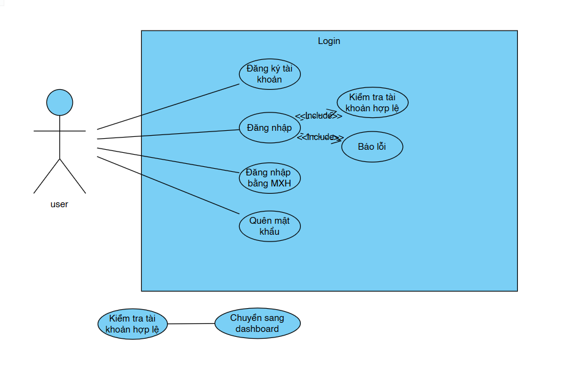

# LAB 03 – LOGIN TESTING USING SELENIUM

## Mục tiêu
Thực hiện kiểm thử tự động (Automation Testing) chức năng **Đăng nhập (Login)** bằng **Python + Selenium + Pytest**.  
Thực hiện: **6 test case**, **locator gọn & chính xác**, **ảnh chụp kết quả**, **README hướng dẫn test case**.

---

## 1. Thiết kế sơ đồ Use Case
*

---

## Quy trình TEST CASE
**Chuẩn bị môi trường**

- Bước 1: Cài Python 3.x 

- Mở CMD tại thư mục dự án:

cd /d E:\lab03-selenium
-->python -m venv .venv
-->.venv\Scripts\activate
-->pip install selenium webdriver-manager pytest

**Khởi chạy test**
- Khởi chạy web server cục bộ

- Mở một CMD khác (giữ cửa sổ này mở suốt lúc test):

-->cd /d E:\lab03-selenium
-->python -m http.server 8000

- Kiểm tra trang chạy: mở trình duyệt vào http://localhost:8000/site/login.html.

- Chạy bộ test Selenium (6 test case)
-->cd /d E:\lab03-selenium
-->.venv\Scripts\activate
-->pytest -q

- **Kết quả test:**
[TEST](PICTURES/login_success.png)
[TEST](PICTURES/signup_link.png)
[TEST](PICTURES/social_buttons.png)
[TEST](PICTURES/wrong_password.png)
[TEST](PICTURES/empty_fields.png)
[TEST](PICTURES/empty_fields.png)
- Quay về cửa sổ CMD có (venv):
......
*6 passed in XXs*
[TEST](PICTURES/ketqua.png)

## Locator sử dụng
- Username: `By.ID, "username"`  
- Password: `By.ID, "password"`  
- Nút LOGIN: `By.ID, "submit"`  
- Link Forgot: `By.LINK_TEXT, "Forgot password?"`  
- Link Sign Up: `By.LINK_TEXT, "SIGN UP"`  
- Nút mạng xã hội: `By.CSS_SELECTOR, ".circle"`  

## Danh sách 6 Test Case
1. **Login thành công** → điều hướng `dashboard.html`  
2. **Sai mật khẩu** → thông báo “Sai tài khoản hoặc mật khẩu”  
3. **Bỏ trống ô nhập** → thông báo “Vui lòng nhập đầy đủ (required)”  
4. **Forgot password** → điều hướng `forgot.html`  
5. **SIGN UP** → điều hướng `signup.html`  
6. **Hiển thị 3 nút social** → tồn tại đủ 3 phần tử `.circle`

---

## Thông tin sinh viên
- Họ tên: Hồ Thị Mai Linh
- Lớp: D23CQPTTK01-N
- Môn: Nhập môn công nghệ phần mềm
- Giảng viên hướng dẫn: Châu Văn Vân
- Bài: LAB 03 – Login Testing using Selenium
